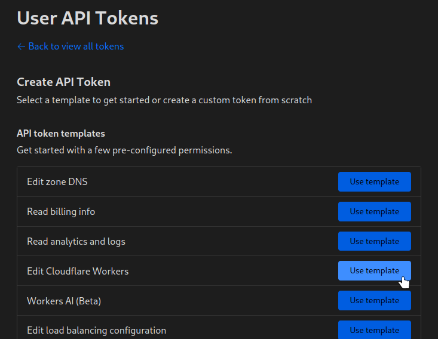

# Cloudflare Pages Cleanup

Old deployments in pages are not always a problem, but can be (for example) if your deployment URLs are public and you make security fix.

## Running

You'll need [Deno](https://docs.deno.com/runtime/manual) to run this script and to clone/download this repo.

Step 1: Create a `.env` file, using the `.env.example` as an example.

```bash
cp .env.example .env
```

<details>
<summary>CLOUDFLARE_ACCOUNT_ID</summary>

You can find your Cloudflare account id in the URL bar, it'll look something like this:


</details>

<details>
<summary>CLOUDFLARE_TOKEN</summary>

You need to create an api token that has permissions on your pages project. You can create that on the [Cloudflare dashboard](https://dash.cloudflare.com/profile/api-tokens).

Select the "Edit Cloudflare Workers template"



</details>

<details>
<summary>CLOUDFLARE_PAGES_PROJECT</summary>
This is the name of your pages project which you set when you created it
</details>

Finally you can run the script

```bash
deno task run
```
